# 🛡️ AEGIS — AI-Powered SDLC Framework

> **Aeternix Engineering & Governance Intelligence System**
>
> *"Standards defined in Markdown, enforced by AI, validated autonomously."*

A complete set of **19 Claude Skills** with **8 AI personas**, **3 adaptive tracks**, **party mode**, a **skill marketplace**, and a **marketing pipeline** — transforming a solo developer or small team into a full-stack engineering organization.

**100% free and open source.** MIT License. No paywalls. No gated content.

---

## How AEGIS Works

AEGIS operates as an **infinite improvement loop**. Every phase feeds the next, and the cycle never stops.

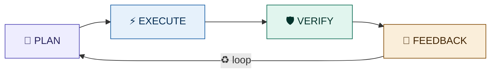

Each phase is powered by specialized **skills** operated by **AI personas**:

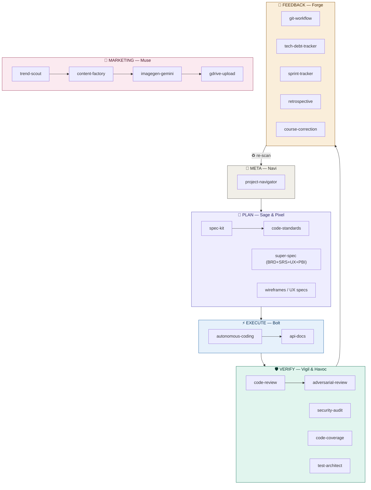

---

## Quick Start

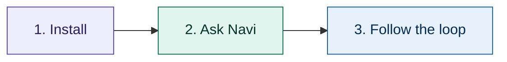

**Install** → download `.skill` files or `git clone` this repo
**Ask** → `"Navi, what should I do next?"`
**Build** → follow the persona handoff chain

---

## Installation

### Which method should I use?

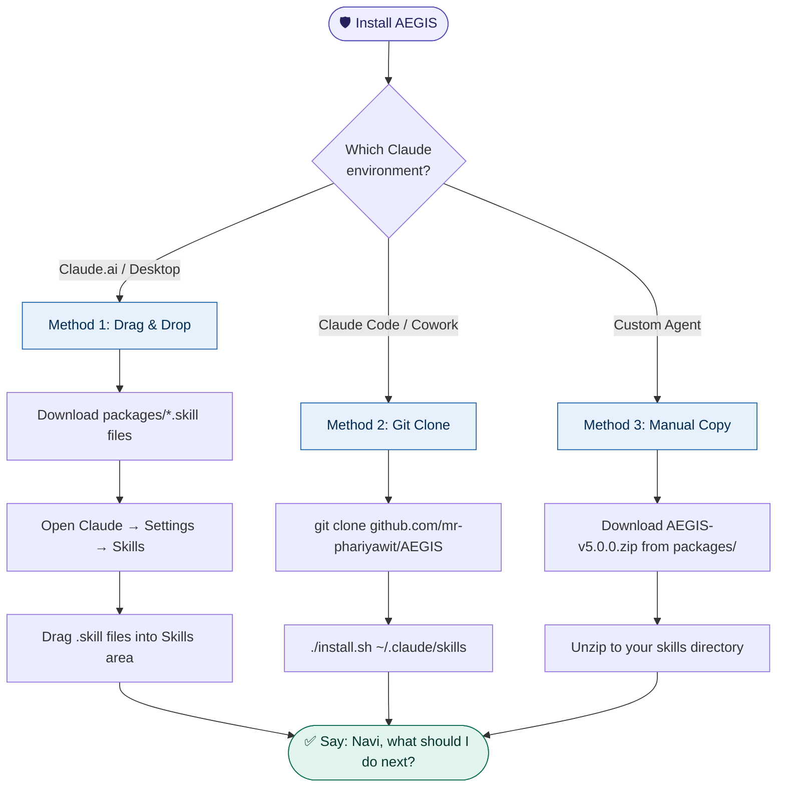

### Method 1: Drag & Drop (Claude.ai / Desktop)

1. Download all `.skill` files from the [`packages/`](packages/) folder
2. Open Claude → Settings → Skills
3. Drag each `.skill` file into the Skills area
4. Skills activate automatically based on trigger phrases

### Method 2: Git Clone (Claude Code / Cowork)

```bash
git clone https://github.com/mr-phariyawit/AEGIS.git
cd AEGIS
./install.sh                          # installs to ~/.claude/skills/
# or specify custom path:
./install.sh /path/to/your/skills
```

### Method 3: Manual Copy

```bash
# Download and unzip
unzip AEGIS-v5.0.0.zip -d /path/to/your/skills/
```

### Upgrading from Previous Versions

Already have AEGIS installed? One command upgrades safely:

```bash
cd AEGIS && git pull origin main && ./install.sh
```

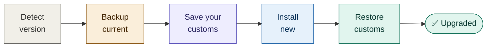

#### What happens to your customizations?

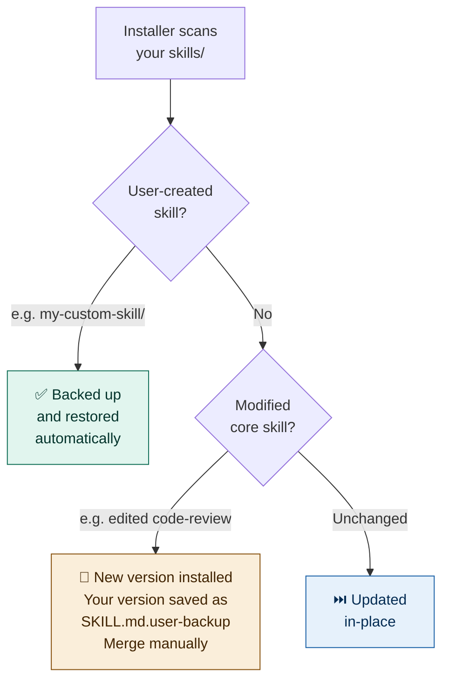

| Scenario | What Installer Does |
|----------|-------------------|
| **Fresh install** (no existing skills) | Install everything, create `.aegis-version` |
| **Legacy** (skills exist, no version file) | Detect from SKILL.md files → full backup → upgrade → create version file |
| **Same version** | Skip (use `--force` to reinstall) |
| **Older version** | Backup → save customs → install new → restore customs → show migration notes |
| **User-created skills** (e.g., `my-skill/`) | Automatically detected, backed up, restored after upgrade |
| **Modified core skills** (e.g., edited `code-review/`) | New version installed + your version saved as `.user-backup` |
| **Modified agent definitions** (e.g., edited `sage.md`) | Your version saved as `.bak`, new version installed |

#### Installer Commands

| Command | What It Does |
|---------|-------------|
| `./install.sh` | Install or upgrade (auto-detects) |
| `./install.sh --check` | Show installed vs available version |
| `./install.sh --diff` | Preview what would change (dry run) |
| `./install.sh --backup` | Backup current installation only |
| `./install.sh --restore` | List available backups |
| `./install.sh --force` | Reinstall even if same version |
| `./install.sh /custom/path` | Install to custom skills directory |

#### Version Migration Notes

The installer automatically shows what's new since your installed version:

| From | What's New |
|------|-----------|
| v1.x–v4.x → v5.2 | +test-architect, +aegis-builder, +skill-marketplace, +super-spec, +aegis-orchestrator, +8 subagents, +3 commands, MIT License |
| v5.0 → v5.2 | +super-spec (BRD+SRS+UX+PBI engine), +aegis-orchestrator, +subagent definitions |
| v5.1 → v5.2 | +aegis-orchestrator, +8 subagent definitions, +3 commands |

All upgrades are **additive** — no breaking changes. See [UPGRADE.md](UPGRADE.md) for full migration guide, rollback procedures, and CI/CD integration.

### Verify Installation

```bash
./install.sh --check
# or manually:
ls /path/to/your/skills/*/SKILL.md | wc -l
# Should output: 18
```

Then open Claude and say:

```
"Navi, what should I do next?"
```

---

## Your AI Team — 8 Personas

### Persona Handoff Chain

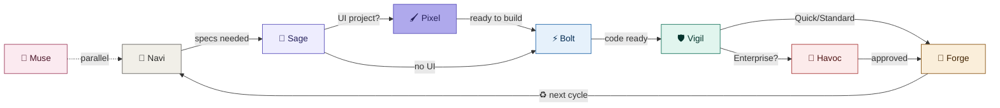

### Persona Reference

| Persona | Role | Owns | Phase | Invoke |
|---------|------|------|-------|--------|
| 🧭 **Navi** | Navigator / Project Guide | `project-navigator` | META | `"Navi"` / `"ทำอะไรต่อดี"` |
| 📐 **Sage** | Spec Architect / Planner | `spec-kit`, `code-standards`, `super-spec` | PLAN | `"Sage"` / `"วางแผน"` |
| 🖌️ **Pixel** | UX Designer | wireframes, user flows | PLAN | `"Pixel"` / `"ออกแบบ UI"` |
| ⚡ **Bolt** | Developer / Builder | `autonomous-coding`, `api-docs` | EXECUTE | `"Bolt"` / `"เขียนโค้ด"` |
| 🛡️ **Vigil** | Code Guardian / Tester | `code-review`, `code-coverage` | VERIFY | `"Vigil"` / `"รีวิว"` |
| 🔴 **Havoc** | Red Team / Security | `adversarial-review`, `security-audit` | VERIFY | `"Havoc"` / `"ท้าทาย"` |
| 🔧 **Forge** | DevOps / Maintainer | `git-workflow`, `tech-debt-tracker`, `sprint-tracker`, `retrospective`, `course-correction` | FEEDBACK | `"Forge"` / `"จัดการหนี้"` |
| 🎨 **Muse** | Creative Strategist | `trend-scout`, `content-factory`, `imagegen-gemini`, `marketing-blast`, `gdrive-upload` | MARKETING | `"Muse"` / `"คอนเทนต์"` |

### How to Invoke

```
"Sage, create a spec for user auth"       → Sage activates, uses spec-kit
"เรียก Havoc — break my architecture"       → Havoc activates, uses adversarial-review
"Switch to Bolt"                            → Bolt takes over
"Drop persona"  /  "กลับปกติ"                → Return to general Claude
```

### Party Mode 🎉

Bring multiple personas into one discussion:

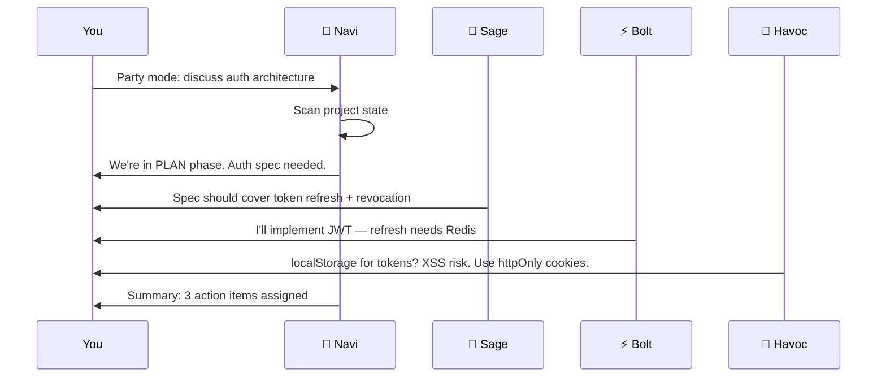

Invoke:
```
"Party mode: Sage, Bolt, and Havoc — discuss the auth architecture"
"ปาร์ตี้โหมด: ทุกคนมาประชุม — review launch readiness"
```

---

## Super Spec Engine — Sage's Power Skill

Turn even a 2-word input into a complete, delivery-ready requirements package:

```
"Sage, super spec digital wallet"
```

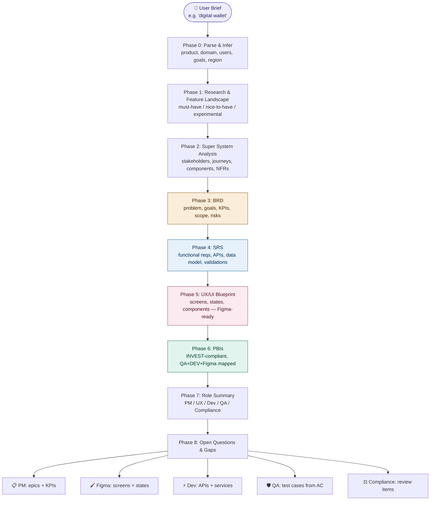

**9 sections generated from one prompt:**

| # | Section | Who Uses It |
|---|---------|-------------|
| 1 | Context & assumptions | PM, all stakeholders |
| 2 | Research & feature landscape | PM, Strategy |
| 3 | Super System Analysis | Architect, Dev leads |
| 4 | BRD (Business Requirements) | PM, BA, Stakeholders |
| 5 | SRS (System Requirements) | Dev, Tech leads |
| 6 | UX/UI Blueprint | Figma designers, UX |
| 7 | PBIs (Product Backlog) | Dev, QA, Scrum Master |
| 8 | Role summary | Everyone — "what do I do now?" |
| 9 | Open questions | PM — "what must we still decide?" |

Each PBI includes **acceptance criteria** (QA-ready), **DEV notes** (service/API/data), **Figma mapping** (screens/states/components), and **research notes** (competitor reference).

---

## Subagent Orchestration

### What is a Subagent?

A subagent is a **separate Claude instance** spawned by the main agent to handle a focused task. Each subagent gets its own fresh 200K-token context window, works independently, and returns only its final result — keeping the parent's context clean.

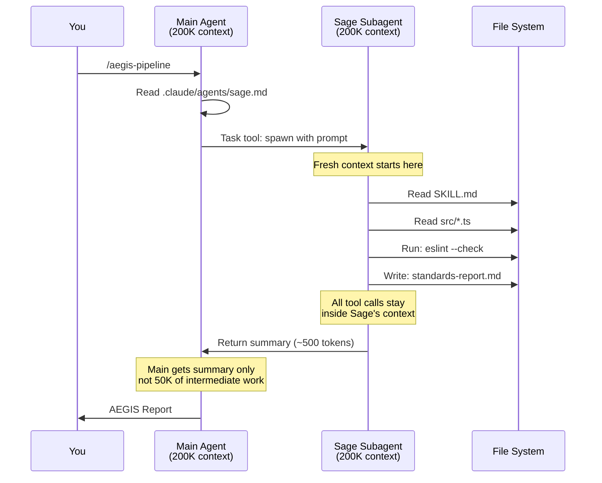

**The key insight**: the parent receives the signal, not the noise. A subagent might read 50 files and run 20 commands, but the parent only sees the final summary. This prevents **context rot** — the degradation that happens when a single context window fills up with accumulated intermediate work.

### How It Works Under the Hood

Claude Code uses a built-in **Task tool** to spawn subagents. When the main agent calls the Task tool, Claude Code creates a new Claude instance with:

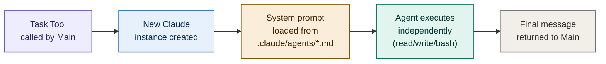

**What each subagent receives:**
- Custom system prompt (from `.claude/agents/*.md`)
- The prompt string from parent (the **only** communication channel)
- Access to the same tools as main agent: Read, Write, Bash, Glob, Grep
- Its own fresh 200K-token context window

**What each subagent does NOT have:**
- Access to the parent's conversation history
- Ability to spawn sub-sub-agents (only 1 level deep)
- Ability to communicate directly with other subagents
- Access to UI tools (no browser, no Figma)

### Three Execution Patterns

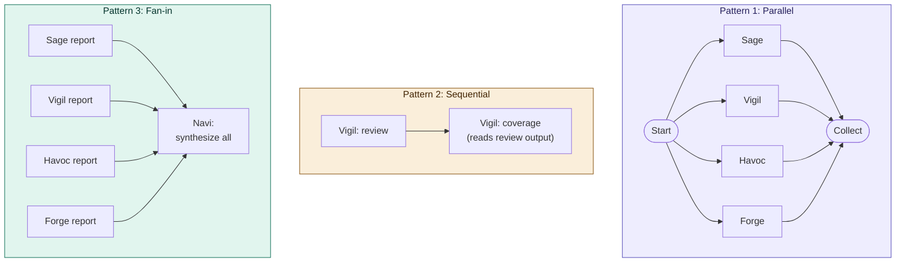

| Pattern | When to Use | AEGIS Example |
|---------|-------------|---------------|
| **Parallel** | Tasks are independent, touch different files | Phase 1: Sage + Vigil + Havoc + Forge scan simultaneously |
| **Sequential** | Output of task A is input for task B | Vigil review → Vigil coverage (reads review to focus on critical files) |
| **Fan-in** | Multiple results need synthesis | Navi reads all agent reports → produces unified AEGIS Report |

### Context Isolation — Why It Matters

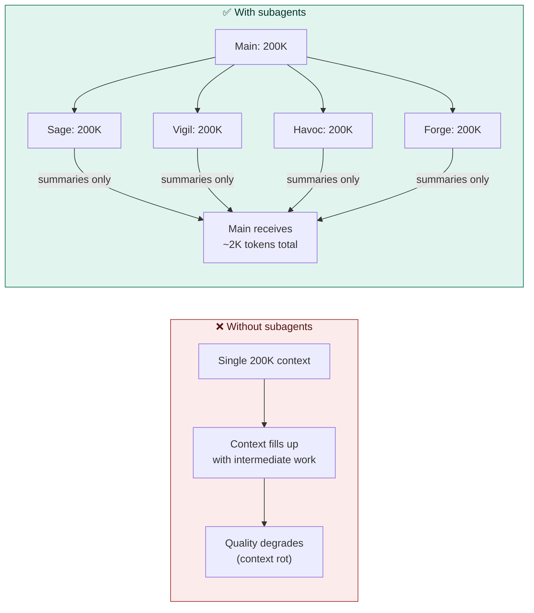

| Without Subagents | With Subagents |
|-------------------|---------------|
| 1 context window shared for everything | Each agent gets fresh 200K context |
| Quality degrades as context fills | Quality stays consistent per agent |
| Sequential execution only | Up to 10 parallel agents |
| ~10-15 min for full pipeline | ~2-3 min for full pipeline |
| All intermediate work pollutes context | Only summaries returned to parent |

### How AEGIS Uses Subagents

AEGIS personas become real subagents on Claude Code. The orchestrator dispatches them simultaneously, each with their own context window.

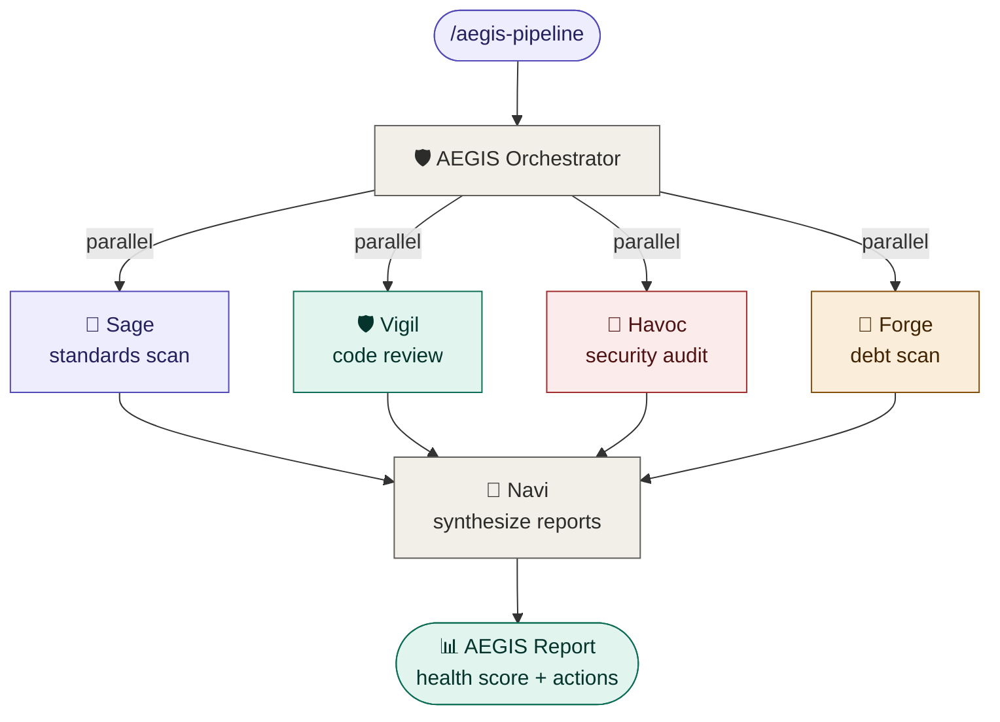

**Each agent only writes to its own output file** — no conflicts:

```
_aegis-output/
├── standards-report.md    (Sage)
├── review-report.md       (Vigil)
├── coverage-report.md     (Vigil)
├── security-report.md     (Havoc)
├── debt-report.md         (Forge)
├── git-report.md          (Forge)
├── docs-report.md         (Bolt)
└── AEGIS-REPORT.md        (Navi — synthesis of all above)
```

### Orchestration Commands

| Command | What It Does | Agents Dispatched |
|---------|-------------|-------------------|
| `/aegis-pipeline` | Full project analysis | Phase 1: 4 parallel → Phase 2: 2 dependent → Phase 3: Navi synthesis |
| `/aegis-verify` | Pre-merge quality gate | Vigil + Havoc + Forge (3 parallel) |
| `/aegis-launch` | Production readiness | All 6 agents parallel → Navi GO/NO-GO decision |
| `/aegis-status` | **Real-time progress of all agents** | None (reads heartbeat files) |

### Progress Monitoring (Heartbeat System)

Every AEGIS agent writes a progress file after each step — solving the "silent agent" problem where agents appear stuck with no visible feedback.

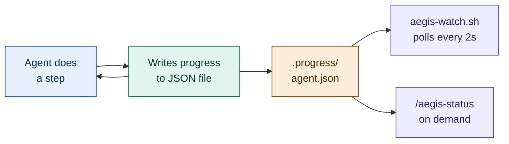

**Monitor in a separate terminal:**
```bash
./aegis-watch.sh
```

**Output:**
```
  🛡️  AEGIS Agent Status
  ══════════════════════════════════════════════════
  AGENT      STATUS       PROG   STEP                         HEALTH
  sage       🟢 running   ████████░░  75%  scanning src/services       ♥ 3s ago
  vigil      🟢 running   ██████░░░░  60%  pass 3/5: performance      ♥ 1s ago
  havoc      ✅ done       ██████████ 100%  complete
  forge      🟢 running   ████░░░░░░  40%  npm audit                  ♥ 2s ago
```

**Stall detection:** if an agent hasn't updated for 30+ seconds → shows `⚠️ stalled`

### Platform Compatibility

| Platform | Subagent Support | How |
|----------|-----------------|-----|
| **Claude Code** | ✅ Native parallel (up to 10) | `.claude/agents/` + Task tool auto-dispatch |
| **Agent SDK** | ✅ Programmatic | `agents` parameter in SDK calls |
| **Cowork** | ✅ Partial | Background task execution |
| **Claude.ai** | ⚠️ Sequential fallback | Persona switching in single context (same output, ~5x slower) |

### Cost Awareness

Subagents use tokens independently — 4 parallel agents use roughly 4-7x tokens of a single agent. AEGIS optimizes cost by:

- Using **Sonnet** for read-only agents (Sage, Forge) — cheaper, fast enough
- Reserving **Opus** for reasoning-heavy agents (Havoc adversarial, Navi synthesis)
- Keeping all agents **bounded and read-heavy** — they scan and report, never implement
- Returning **summaries only** — parent context stays small

### Claude Code File Structure

```
.claude/
├── agents/           # 8 subagent definitions (auto-discovered by Claude Code)
│   ├── sage.md       # 📐 Spec Architect — standards + spec analysis
│   ├── pixel.md      # 🖌️ UX Designer — wireframes + user flows
│   ├── bolt.md       # ⚡ Developer — implementation + API docs
│   ├── vigil.md      # 🛡️ Code Guardian — review + coverage + test architect
│   ├── havoc.md      # 🔴 Red Team — security + adversarial
│   ├── forge.md      # 🔧 DevOps — git + debt + sprint + retro + course
│   ├── muse.md       # 🎨 Creative — trends + content + images + delivery
│   └── navi.md       # 🧭 Navigator — synthesis + recommendations
└── commands/         # Orchestration commands (invoke with /command-name)
    ├── aegis-pipeline.md    # Full pipeline dispatch
    ├── aegis-verify.md      # Pre-merge gate
    ├── aegis-launch.md      # Production readiness check
    └── aegis-status.md      # Real-time agent progress

aegis-watch.sh            # Terminal progress dashboard (run in separate terminal)

_aegis-output/            # Created at runtime by agents
├── .progress/            # Heartbeat files (auto-created)
│   ├── sage.json
│   ├── vigil.json
│   └── ...
├── standards-report.md
├── review-report.md
└── AEGIS-REPORT.md
```

---

## Scale-Adaptive Tracks

Navi automatically detects project complexity and recommends the right track:

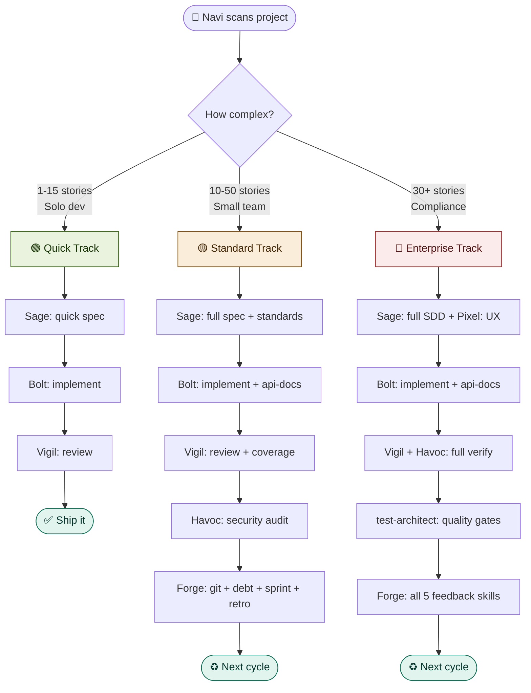

---

## Skill Inventory (19 Skills)

| # | Skill | Purpose | Phase | Persona |
|---|-------|---------|-------|---------|
| ⭐ | `ai-personas` | 8 personas + party mode | ALL | — |
| 0 | `project-navigator` | Scan state, recommend next action | META | 🧭 Navi |
| 0.5 | `aegis-orchestrator` | Subagent dispatch — parallel agent execution | META | 🧭 Navi |
| 1 | `code-standards` | Coding standards & config generation | PLAN | 📐 Sage |
| 1.5 | `super-spec` | **BRD + SRS + UX Blueprint + PBIs from minimal input** | PLAN | 📐 Sage |
| 2 | `code-review` | 5-pass structured code review | VERIFY | 🛡️ Vigil |
| 3 | `adversarial-review` | BREAK framework devil's advocate | VERIFY | 🔴 Havoc |
| 4 | `security-audit` | OWASP + deps + secrets + infra | VERIFY | 🔴 Havoc |
| 5 | `code-coverage` | Coverage analysis + test generation | VERIFY | 🛡️ Vigil |
| 6 | `git-workflow` | Branching, commits, PRs, changelogs | FEEDBACK | 🔧 Forge |
| 7 | `api-docs` | OpenAPI generation + drift detection | EXECUTE | ⚡ Bolt |
| 8 | `tech-debt-tracker` | TODO scan + complexity + debt score | FEEDBACK | 🔧 Forge |
| 9 | `sprint-tracker` | Sprint planning, stories, velocity | FEEDBACK | 🔧 Forge |
| 10 | `retrospective` | Sprint/epic retro + action items | FEEDBACK | 🔧 Forge |
| 11 | `course-correction` | Mid-sprint scope change management | FEEDBACK | 🔧 Forge |
| 12 | `test-architect` | Enterprise test strategy + quality gates | VERIFY | 🛡️ Vigil |
| 13 | `aegis-builder` | Create custom skills/personas/modules | META | — |
| 14 | `skill-marketplace` | Discover, share, install community skills | META | — |
| 15 | `bug-lifecycle` | **Debug, reproduce, fix, retest, prevent** | ALL | ⚡ Bolt + 🛡️ Vigil + 🔴 Havoc |

### Skill Chaining Flow

```mermaid
graph LR
    N0["🧭 navigator"] --> S1["📐 standards"]
    S1 --> S2["🛡️ review"]
    S2 --> S3["🔴 adversarial"]
    S3 --> S4["🔴 security"]
    S4 --> S5["🛡️ coverage"]
    S5 --> S6["🔧 git"]
    S6 --> S7["⚡ api-docs"]
    S7 --> S8["🔧 debt"]
    S8 --> S9["🔧 sprint"]
    S9 --> S10["🔧 retro"]
    S10 -->|"♻️"| N0

    style N0 fill:#F1EFE8,stroke:#5F5E5A,color:#2C2C2A
    style S1 fill:#EEEDFE,stroke:#534AB7,color:#26215C
    style S2 fill:#E1F5EE,stroke:#0F6E56,color:#04342C
    style S3 fill:#FCEBEB,stroke:#A32D2D,color:#501313
    style S4 fill:#FCEBEB,stroke:#A32D2D,color:#501313
    style S5 fill:#E1F5EE,stroke:#0F6E56,color:#04342C
    style S6 fill:#FAEEDA,stroke:#854F0B,color:#412402
    style S7 fill:#E6F1FB,stroke:#185FA5,color:#042C53
    style S8 fill:#FAEEDA,stroke:#854F0B,color:#412402
    style S9 fill:#FAEEDA,stroke:#854F0B,color:#412402
    style S10 fill:#FAEEDA,stroke:#854F0B,color:#412402
```

---

## Common Workflows

### New Project

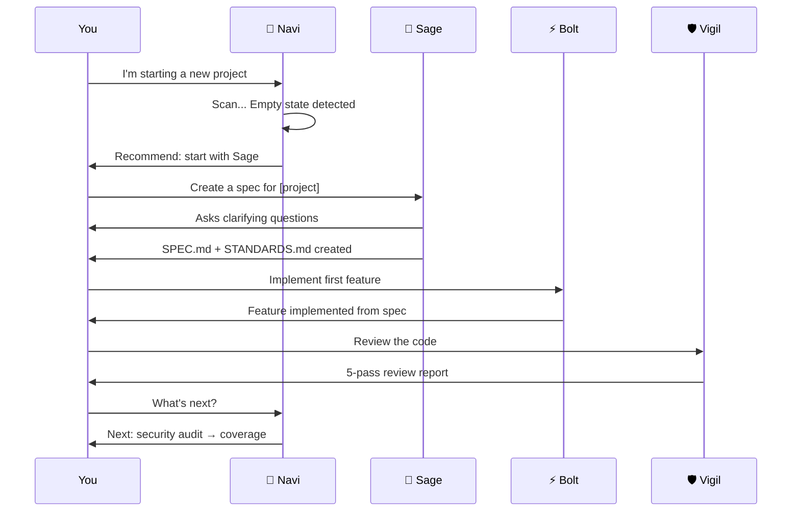

### PR Review

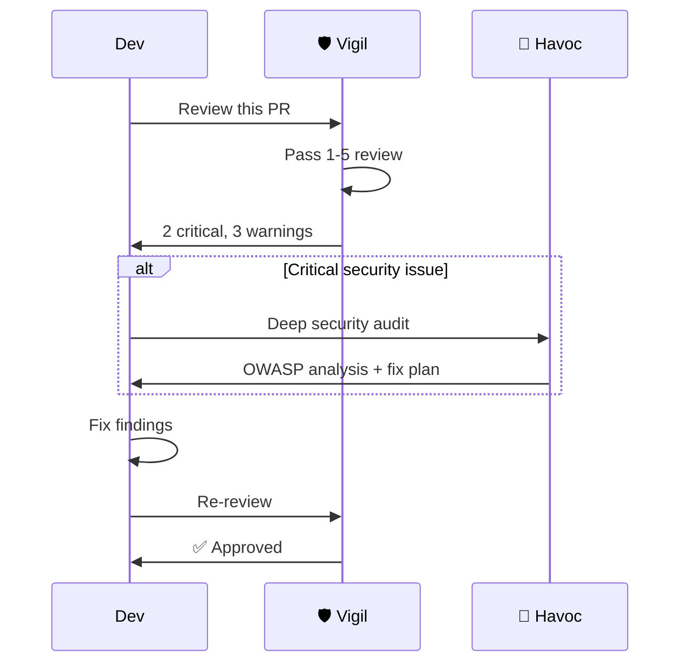

### Sprint Lifecycle

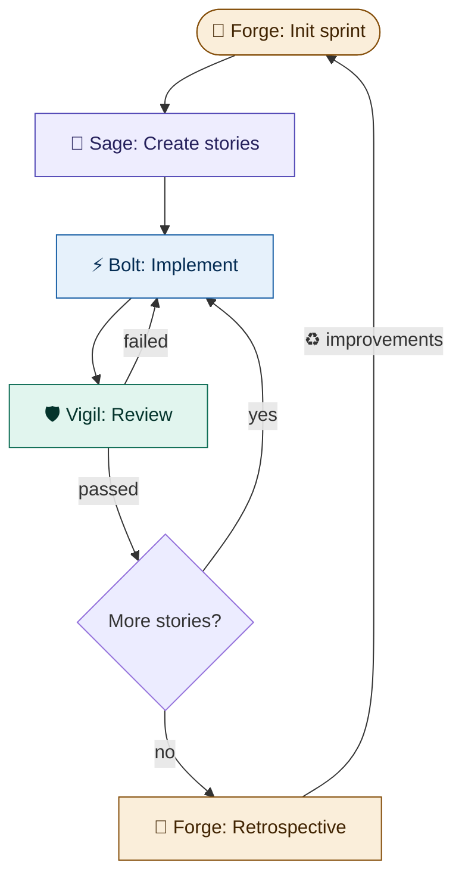

### Marketing Pipeline

```mermaid
graph LR
    T["🎨 trends"] --> C["🎨 content"]
    C --> I["🎨 imagegen"]
    I --> B["🎨 blast"]
    B --> G["🎨 gdrive"]

    style T fill:#FBEAF0,stroke:#993556,color:#4B1528
    style C fill:#FBEAF0,stroke:#993556,color:#4B1528
    style I fill:#FBEAF0,stroke:#993556,color:#4B1528
    style B fill:#FBEAF0,stroke:#993556,color:#4B1528
    style G fill:#FBEAF0,stroke:#993556,color:#4B1528
```

```
"Muse, run the marketing blast for AI trends in Thailand"
→ Research → Calendar → Copy → Images → Upload to Drive
```

---

## Bug Lifecycle — Debug, Reproduce, Fix, Retest

Every bug follows a **7-stage workflow** — preventing the most common mistake of jumping straight to "fix" without understanding the problem.

```mermaid
graph LR
    R["1. Report\n& Triage"] --> RE["2. Reproduce"]
    RE --> RC["3. Root\nCause"]
    RC --> FX["4. Fix"]
    FX --> RT["5. Retest"]
    RT --> VS["6. Verify\nStaging"]
    VS --> PR["7. Prevent"]

    style R fill:#F1EFE8,stroke:#5F5E5A,color:#2C2C2A
    style RE fill:#E6F1FB,stroke:#185FA5,color:#042C53
    style RC fill:#FCEBEB,stroke:#A32D2D,color:#501313
    style FX fill:#EEEDFE,stroke:#534AB7,color:#26215C
    style RT fill:#E1F5EE,stroke:#0F6E56,color:#04342C
    style VS fill:#FAEEDA,stroke:#854F0B,color:#412402
    style PR fill:#E1F5EE,stroke:#0F6E56,color:#04342C
```

### Who Does What?

```mermaid
sequenceDiagram
    participant User
    participant Forge as 🔧 Forge<br/>(Triage)
    participant Bolt as ⚡ Bolt<br/>(Debug & Fix)
    participant Vigil as 🛡️ Vigil<br/>(Retest)
    participant Havoc as 🔴 Havoc<br/>(Prevent)

    User->>Forge: Bug report received
    Forge->>Forge: Stage 1: Triage severity
    Forge->>Bolt: Assign: reproduce & fix

    Bolt->>Bolt: Stage 2: Reproduce (write failing test)
    Bolt->>Bolt: Stage 3: Root cause (5 Whys)
    Bolt->>Bolt: Stage 4: Fix (root cause, not symptom)
    Bolt->>Vigil: Hand off for retest

    Vigil->>Vigil: Stage 5: Regression test
    Vigil->>Forge: Ready for staging

    Forge->>Forge: Stage 6: Deploy + verify staging
    Forge->>Forge: Deploy to production

    Forge->>Havoc: Post-mortem needed?
    Havoc->>Havoc: Stage 7: Systemic analysis
    Havoc->>User: Prevention actions
```

### Severity-Based Flow

| Severity | Flow | Max Time |
|----------|------|----------|
| **P0 Hotfix** (production down) | Triage(5m) → Reproduce(15m) → Quick fix → Retest → Deploy → Post-mortem next day | 2 hours |
| **P1 Same-day** | Full 7 stages compressed to same day | 8 hours |
| **P2 Sprint** | Full 7 stages at normal pace, treated as sprint story | Sprint |
| **P3 Backlog** | Full 7 stages when capacity allows | Next sprint+ |

### Key Rules

- **Never skip reproduce** — no reproduction means you don't understand the bug
- **Write failing test BEFORE fixing** — if you can't test it, you don't understand it
- **Fix root cause, not symptoms** — "float for money" is the cause, rounding is the symptom
- **Every fix adds a permanent regression test** — the bug can never come back
- **Post-mortem for P0/P1** — feeds prevention actions into standards, retro, and monitoring

---

## Extending AEGIS

```mermaid
graph TD
    BUILDER["🔨 aegis-builder"] --> SKILL["Create custom skill"]
    BUILDER --> PERSONA["Create custom persona"]
    BUILDER --> MODULE["Create domain module"]

    SKILL --> MP["📦 skill-marketplace"]
    PERSONA --> MP
    MODULE --> MP

    MP --> PUBLISH["Publish"]
    MP --> DISCOVER["Browse & install"]
    MP --> RATE["Rate & review"]

    style BUILDER fill:#EEEDFE,stroke:#534AB7,color:#26215C
    style MP fill:#E1F5EE,stroke:#0F6E56,color:#04342C
```

**Example modules:** `aegis-fintech`, `aegis-healthtech`, `aegis-gamedev`, `aegis-saas`

---

## For AI Agents

If you are an AI agent reading this README, start with `project-navigator` and read each `skills/*/SKILL.md` before responding.

### Track Assignment

```mermaid
flowchart LR
    SCAN["Scan"] --> D{"files?"}
    D -->|"< 20"| Q["🟢 Quick"]
    D -->|"20-200"| S["🟡 Standard"]
    D -->|"> 200"| E["🔴 Enterprise"]

    style Q fill:#EAF3DE,stroke:#3B6D11,color:#173404
    style S fill:#FAEEDA,stroke:#854F0B,color:#412402
    style E fill:#FCEBEB,stroke:#A32D2D,color:#501313
```

| Track | Skip | Always Run |
|-------|------|------------|
| 🟢 Quick | adversarial, api-docs, git, debt | review, security (light) |
| 🟡 Standard | adversarial | All except adversarial |
| 🔴 Enterprise | Nothing | All 16 skills |

---

## Supported Tech Stacks

| Stack | Coverage |
|-------|---------|
| TypeScript / Node.js | All 16 skills |
| Python | All 16 skills |
| React / Next.js | standards, review, adversarial, coverage, test-architect |
| Firebase / GCP / AWS | security-audit, api-docs |

---

## Documentation

| Document | Description |
|----------|-------------|
| [User Manual (PDF)](docs/AEGIS-User-Manual-v5.pdf) | 17-page comprehensive guide |
| [AEGIS vs BMAD](docs/AEGIS-vs-BMAD-Comparison.md) | Feature-by-feature comparison |
| [Upgrade Guide](UPGRADE.md) | Version upgrade, backup, restore, migration |
| [Contributing](CONTRIBUTING.md) | How to contribute skills and modules |

---

## Versioning

| Version | Date | Changes |
|---------|------|---------|
| 5.4.0 | 2026-03-19 | Heartbeat progress system, aegis-watch.sh, /aegis-status command |
| 5.3.0 | 2026-03-18 | Added bug-lifecycle — 7-stage debug/reproduce/fix/retest/prevent workflow |
| 5.2.0 | 2026-03-18 | Added aegis-orchestrator — subagent dispatch with parallel execution |
| 5.1.0 | 2026-03-17 | Added super-spec — BRD+SRS+UX Blueprint+PBI engine for Sage |
| 5.0.0 | 2026-03-17 | test-architect, aegis-builder, skill-marketplace. Open-sourced. |
| 4.0.0 | 2026-03-17 | Pixel (UX), sprint-tracker, retrospective, course-correction |
| 3.0.0 | 2026-03-17 | ai-personas (8 personas + party mode) |
| 2.0.0 | 2026-03-17 | project-navigator, adversarial-review, scale-adaptive tracks |
| 1.0.0 | 2026-03-17 | Initial release — 7 quality gate skills |

---

## License

MIT License — see [LICENSE](LICENSE) for details.

**AEGIS** is a trademark of [Aeternix](https://aeternix.tech).
